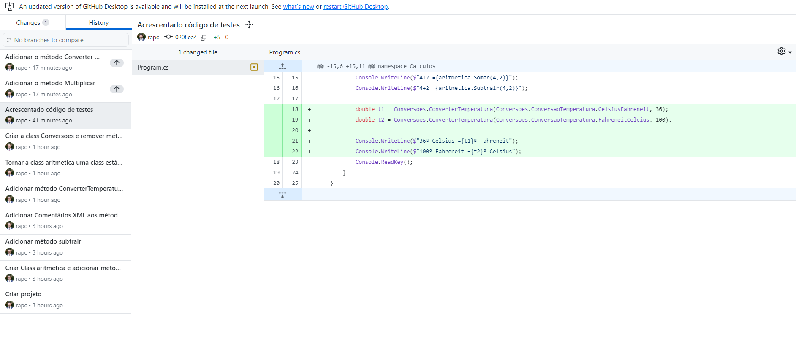

# Cálculos :1234:
 Aplicação C# para efetuar diversos Cálculo

 

 Esta aplicação foi desenvolvida no *âmbito* da **_ação de formação_** **Introdução ao Git e GitHub**

## Operações Suportadas 

Neste momento esta aplicação implementa as seguintes operações: 
- soma 
- subtração 
- multiplicação 
- conversão de temperaturas 
    - celsius :arrow_right: fahrenheit
    - fahrenheit :arrow_right: celsius

- conversão de distâncias 
    - metros :arrow_right: milhas
    - milhas :arrow_right: metros

## Tecnologias Utilizadas 
- **Visual Studio**
- C#
- Git
- GitHub Desktop
- Plataforma GitHub

## Site Oficial
Faça download desta aplicação no site oficial: [www.eruditate.com](https://www.eruditate.com)

Nota: URL meramente de teste no âmbito da Formação

### Autor 
Ricardo Castro 